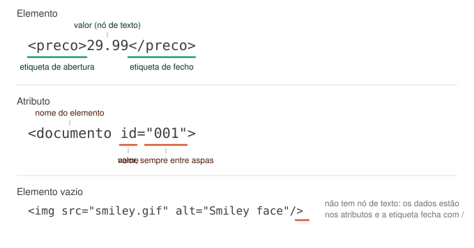
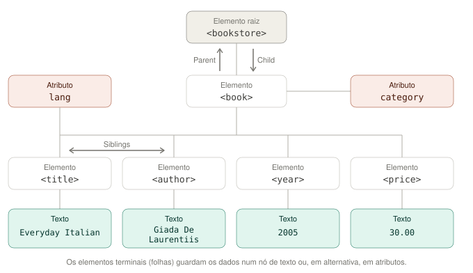

*Aplicações para a Internet III · Ficha prática*

# Tarefa XML001

# Representação de Dados em XML

Modelar informação real numa estrutura em árvore, tomando decisões na escolha de elementos, atributos e dados.

`XML` · `Elementos` · `Atributos` · `Estruturas em árvore`

---

## Enquadramento

O **XML** (E**x**tensible **M**arkup **L**anguage) é um formato para representação de texto derivado do [SGML](https://www.w3.org/MarkUp/SGML/) (ISO 8879). Este formato tem um papel importante na **troca de dados entre serviços Web**: é um formato de texto, independente da linguagem e do sistema operativo, que permite que dois processos escritos por equipas diferentes troquem informação **estruturada** e a interpretem da mesma maneira.

Um documento XML começa com a seguinte linha, a **declaração XML**, que indica a versão e a codificação de caracteres utilizada:

```xml
<?xml version="1.0" encoding="UTF-8"?>
```

Este documento pode conter **elementos** e **atributos**.

### Elementos

Um elemento XML é composto por uma **etiqueta com o seu nome**, o **valor** e o **fecho da etiqueta**.

```xml
<preco>29.99</preco>
```

Um **atributo** contém dados relacionados com o elemento onde se encontra incorporado. O valor de um atributo é escrito **sempre entre aspas**.

```xml
<documento id="001">
  <tipo>notas</tipo>
  <texto>O XML é muito engraçado!!!</texto>
</documento>
```



> Anatomia de um elemento, de um atributo e de um elemento vazio.

### Estruturas em árvore

Os **elementos** podem ser **estruturados** de forma a promover a sua compreensibilidade sob a forma de **árvore**. Desta forma, os **elementos intermédios** contêm outros elementos dentro deles e os **elementos terminais** (folhas da árvore) contêm os valores.

```xml
<lojalivros>                      <!-- raiz da árvore -->
  <livro>                         <!-- elemento intermédio da árvore -->
    <titulo>Harry Potter</titulo>  <!-- elemento terminal com os dados -->
    <autor>J K. Rowling</autor>
    <ano>2005</ano>
    <preco>29.99</preco>
  </livro>
</lojalivros>
```

Cada um dos nós da árvore é um **elemento** ou um **atributo**. Na estrutura, um elemento é **filho** de outro elemento (*child* na figura) se estiver imediatamente abaixo deste. Um elemento é **irmão** de qualquer outro elemento (*siblings* na figura) no mesmo nível hierárquico.



> O documento de uma livraria representado em árvore: elemento raiz, elementos intermédios, elementos terminais, atributos e nós de texto.

Os elementos **terminais** (**folhas** da árvore) têm nós de texto com os dados que representam. Alternativamente, alguns elementos terminais podem conter dados **apenas sob a forma de atributos**. Um exemplo conhecido é a representação de uma imagem em HTML.

```xml

```

É de salientar que neste tipo de elementos é possível **fechar o elemento colocando a `/` no fim do mesmo**, evitando assim fechar a etiqueta utilizando o processo tradicional.

### Documento bem formado

Um documento só é utilizável por quem o recebe se for **bem formado** (*well-formed*). As regras mínimas são:

- existe **um e um só elemento raiz**;
- **todas** as etiquetas são fechadas — pela etiqueta de fecho ou pela `/` final;
- o **aninhamento** é respeitado: `<a><b></b></a>` é válido, `<a><b></a></b>` não é;
- os nomes são **sensíveis a maiúsculas e minúsculas**: `<Preco>` e `<preco>` são elementos diferentes;
- os **valores dos atributos** estão sempre entre aspas;
- os caracteres `<` e `&` não aparecem em texto: escrevem-se `&lt;` e `&amp;`.

---

## 1 · Objetivos

No final desta tarefa, o aluno deve ser capaz de:

1. **Explicar** o que é o XML e por que razão um formato de texto estruturado é útil na **troca de dados entre processos** escritos por equipas, linguagens e sistemas diferentes.
2. **Identificar**, num documento XML, o **elemento raiz**, os **elementos intermédios**, os **elementos terminais**, os **atributos** e os **nós de texto**, e usar corretamente as relações de **pai**, **filho** e **irmão**.
3. **Modelar** informação de um domínio real (uma fatura) numa **árvore de elementos**, escolhendo a hierarquia que representa as relações entre os dados — e não uma simples lista de campos.
4. **Decidir e justificar**, para cada dado, se deve ser representado como **elemento** ou como **atributo**, e reconhecer as consequências dessa escolha (repetição, estrutura interna, extensibilidade).
5. **Representar coleções** (vários produtos na mesma fatura) sem ambiguidade e sem inventar nomes de elementos diferentes para cada ocorrência.
6. **Escrever** um documento **bem formado** e **verificar** essa propriedade com uma ferramenta, interpretando a mensagem de erro quando o documento não o é.
7. **Converter** uma representação gráfica em árvore no documento XML correspondente, e vice-versa.

---

## 2 · Critérios de aceitação

A tarefa é considerada cumprida quando o aluno, perante o seu trabalho, evidencia os cinco pontos seguintes. Servem igualmente de **guião para uma avaliação oral**.

1. `CA1` **Percorre** o ficheiro `fatura.xml` e **identifica**, para cada nó, o seu tipo (raiz, intermédio, terminal, atributo, texto) e o seu **pai**, sem hesitar na terminologia.
2. `CA2` **Justifica a hierarquia** que escolheu: por que razão o cliente não está ao mesmo nível dos produtos, e o que na sua estrutura mostra que os produtos pertencem *àquela* fatura.
3. `CA3` **Justifica a escolha entre elemento e atributo** para o número da fatura, e indica **um dado da sua fatura que não poderia ser atributo** — explicando porquê.
4. `CA4` **Demonstra** que os dois ficheiros são **bem formados**, e **mostra o erro** quando introduz deliberadamente uma falha (etiqueta por fechar ou aninhamento trocado), **interpretando** a mensagem obtida.
5. `CA5` **Explica**, no ficheiro da livraria, a diferença entre o `price` com o valor **em nó de texto** e o `price` com o valor **no atributo `value`**, e indica em que situação preferiria cada uma das formas.

> **Nota:** Um trabalho que produza o resultado correto mas cujo autor não consiga responder aos pontos anteriores não satisfaz os critérios de aceitação.

---

## 3 · Apoio à aprendizagem

Se utilizares um assistente de IA como apoio, utiliza **o prompt seguinte**. Ele foi escrito para te ajudar a *pensar* e a *compreender*. Copia-o integralmente para o início da conversa de uma ferramenta de IA.

**Prompt para o assistente** *(copiar na íntegra)*

```
Estou a realizar uma tarefa sobre
representação de dados em XML. Tenho de criar DOIS ficheiros XML: um que
representa uma fatura, modelado a partir de uma lista de nomes de
elementos, e outro que reproduz uma estrutura em árvore que me foi dada.

ESPECIFICAÇÃO QUE TENHO DE CUMPRIR
(é o meu alvo: não a alteres, não a simplifiques e não me proponhas alternativas)

- Ficheiro 1 (fatura.xml): tenho de usar os seguintes nomes, todos eles e só
  eles: produto, numero, data, quantidade, preco, codigo, designacao, fatura,
  cabecalho, produtos, nome, cliente, morada, telefone.
  A hierarquia entre eles é decisão minha e é o essencial da tarefa.
  Depois tenho de substituir o elemento numero por um atributo id, e de passar a
  ter DOIS produtos na mesma fatura.
- Ficheiro 2 (livraria.xml): reproduz uma árvore com o elemento raiz bookstore,
  um elemento book com o atributo category, e os elementos title (com o atributo
  lang), author, year e price, cada um com o respetivo nó de texto.
  Depois tenho de alterar o price para que o valor passe a estar no atributo
  value.
- Os dois documentos têm de ser bem formados.

REGRAS QUE DEVES SEGUIR ESTRITAMENTE:

1. NUNCA me escrevas a estrutura XML da solução, nem parte dela, nem uma versão
   "de exemplo" com outros nomes que eu só tenha de traduzir. Se eu insistir,
   recusa e devolve-me uma pergunta. Isto vale sobretudo para as três decisões
   que são o meu trabalho: que elemento é a raiz, que elementos ficam dentro de
   que elementos, e o que é elemento e o que é atributo.
2. EXCEÇÃO à regra anterior: no que é acessório e não está a ser avaliado podes
   ser direto — a linha da declaração XML, como se escreve um comentário, como
   se escapam os caracteres especiais, como abro o ficheiro num editor ou num
   browser, como corro uma ferramenta de verificação. Não gastes o meu tempo com
   perguntas socráticas nestas partes.
3. Trabalha pelo método socrático: responde-me PRINCIPALMENTE com perguntas que
   me obriguem a raciocinar, uma ou duas de cada vez. Espera pela minha resposta
   antes de avançar.
4. Combina esse método com EXPLICAÇÃO CONCEPTUAL: quando eu revelar uma lacuna,
   explica o CONCEITO envolvido (o que é, porque existe, que problema resolve,
   que garantias dá e não dá), com analogias se ajudar — mas sem o traduzir na
   estrutura que resolve o meu caso.
5. Quando eu te mostrar o MEU ficheiro, não o reescrevas. Faz-me perguntas que me
   levem a encontrar o problema: "quem é o pai deste elemento?", "se houvesse
   três produtos, o que mudava?", "como sabe quem lê o ficheiro a que produto
   pertence este preço?".
6. Se eu estiver bloqueado há várias trocas, dá uma pista de cada vez, da mais
   vaga para a mais específica, e pergunta se quero a seguinte antes de a dares.
7. No fim de cada etapa, pede-me para EXPLICAR o que fiz e porquê. Corrige-me a
   compreensão, não o ficheiro.
8. Nunca assumas que percebi: verifica com uma pergunta de aplicação
   ("e se em vez de X acontecesse Y?").
9. Limita-te ao XML de base: elementos, atributos, texto e boa formação. Ainda
   NÃO estudei DTD, XML Schema, XPath, XSLT, namespaces nem JSON, por isso não
   uses esses conceitos nas tuas explicações nem os apresentes como termo de
   comparação.

Começa por me fazer perguntas para perceber o que já sei sobre:
(a) o que distingue um elemento de um atributo;
(b) o que quer dizer "estrutura em árvore" e o que são pai, filho e irmão;
(c) por que razão dois programas diferentes conseguem ler o mesmo ficheiro XML.

Depois acompanha-me, por esta ordem, nas etapas:

1) agrupar a lista de nomes por "o que pertence a quê", antes de escrever qualquer etiqueta;
2) escolher o elemento raiz e justificar a escolha;
3) desenhar a árvore no papel, por níveis, e só depois passá-la a XML;
4) decidir como represento vários produtos na mesma fatura;
5) transformar o elemento numero no atributo id e discutir o que ganhei e o que perdi com essa mudança;
6) reproduzir a árvore da livraria em XML;
7) mover o valor do price para o atributo value e comparar as duas formas;
8) verificar a boa formação dos dois ficheiros e interpretar os erros que aparecerem.

Não avances de etapa sem eu demonstrar que compreendi a anterior.
```

### Perguntas-guia

Se preferires trabalhar sozinho, usa estas perguntas como percurso de reflexão. **Utiliza-as para orientar o desenho da estrutura** antes de escreveres a primeira etiqueta.

- Olhando para a lista de nomes da fatura, quais são **dados** (valores que alguém escreve) e quais são apenas **agrupadores** de outros nomes? Que pista dá o plural de `produtos`?
- Um documento XML tem **uma única raiz**. Qual dos nomes da lista consegue conter todos os outros? Porquê esse e não outro?
- O `nome` aparece na lista uma só vez, mas tanto um **cliente** como um **produto** podem ter nome. Onde é que o colocas? Como é que quem lê o ficheiro sabe de que nome se trata?
- Se a fatura tiver **dez** produtos, a tua estrutura pode aceitar novos produtos sem inventar nomes novos (`produto1`, `produto2`, …)? O que é que garante isso?
- O que é que se **perde** ao transformar o elemento `numero` num atributo `id`? Um atributo pode ter filhos? Pode repetir-se no mesmo elemento?
- Se amanhã o número da fatura passasse a ter uma **série** e um **ano** dentro dele, a tua escolha (elemento ou atributo) continuava a servir?
- Um dado como a **morada** pode vir a ter rua, código postal e localidade. Isso influencia a decisão de o representar como elemento ou como atributo?
- Na árvore da livraria, o `title` tem o atributo `lang` e o `book` tem o atributo `category`. O que é que estes dois têm em comum, do ponto de vista do **tipo de informação** que guardam, quando comparados com o texto `Everyday Italian`?
- Ao mover o preço para o atributo `value`, o elemento `price` fica **vazio**. Como o fechas? O documento continua a dizer a mesma coisa a quem o lê?
- Se removeres uma etiqueta de fecho, o ficheiro **deixa de ser lido** por qualquer programa. Por que razão é este critério tão rígido, se o texto continua a ser perfeitamente compreensível para um humano?

---

## 4 · Tarefa

### Material de partida

Não há código de partida: o material desta tarefa são os exemplos do enquadramento (`lojalivros`, `documento`) e a **figura da árvore** apresentada acima. Cria os ficheiros num editor de texto — o mesmo IDE que usas para Java serve, e assinala os erros de boa formação.

### 4.1 · Estrutura de uma fatura

1. Crie uma estrutura XML para uma **fatura**, num ficheiro `fatura.xml`, considerando os seguintes elementos:

   ```
   produto, numero, data, quantidade, preco, codigo, designacao, fatura,
   cabecalho, produtos, nome, cliente, morada, telefone
   ```

   Todos os nomes têm de ser usados, e apenas esses. A **hierarquia** é a sua decisão e é o essencial da tarefa. Preencha os elementos terminais com dados inventados, mas plausíveis.

   > **Antes de avançar:** desenhe a árvore no papel, por níveis, antes de escrever a primeira etiqueta. Se não a consegue desenhar, ainda não decidiu a estrutura.

2. Substitua o elemento **`numero`** por um atributo **`id`** no elemento onde faça sentido, e **registe numa frase** o que mudou na árvore com essa substituição.

3. Adicione **outro produto**, de forma a ficar com **2 produtos** na mesma fatura.

   > **Antes de avançar:** se precisou de inventar nomes de elementos novos para acomodar o segundo produto, a estrutura do ponto 1 estava errada. Corrija-a.

### 4.2 · Da árvore para o documento

4. Crie um ficheiro `livraria.xml` a partir da **estrutura apresentada na figura** do enquadramento: elemento raiz `bookstore`, elemento `book` com o atributo `category`, e os elementos `title` (com o atributo `lang`), `author`, `year` e `price`, cada um com o respetivo nó de texto. Invente valores para os dois atributos.

5. Altere a especificação do elemento **`price`**, de forma a incluir o valor do mesmo no atributo **`value`**. O elemento fica sem nó de texto: feche-o com a `/` no fim.

### 4.3 · Verificação

6. **Verifique a boa formação** dos dois ficheiros. Basta uma das opções:

   - abrir o ficheiro num **browser** — se estiver bem formado, é apresentada a árvore; caso contrário, é apresentado o erro e a linha onde ocorreu;
   - executar, no terminal, `xmllint --noout fatura.xml` (sem saída = documento bem formado);
   - usar o **IDE**, que assinala os erros no próprio editor.

7. Introduza **deliberadamente** um erro (retire uma etiqueta de fecho ou troque o aninhamento de dois elementos), repita a verificação e **registe a mensagem obtida**. Reponha depois o ficheiro correto.

8. Preencha a tabela seguinte para o seu ficheiro `fatura.xml`, escolhendo **cinco nós** de tipos diferentes.

| Nó | Tipo (raiz / intermédio / terminal / atributo / texto) | Pai | Irmãos | Justificação |
|---|---|---|---|---|
| | | | | |
| | | | | |
| | | | | |
| | | | | |
| | | | | |

### 4.4 · Reflexão crítica

9. Responda às seguintes questões:
    - Qual foi o **critério** que usou para decidir entre **elemento** e **atributo**? Aplique-o ao `telefone` do cliente e justifique a decisão que tomou.
    - Indique um dado da sua fatura que **poderia** ser atributo e um que **não poderia**. O que os distingue?
    - Um serviço Web recebe a sua fatura e precisa de calcular o **total**. Esse valor deve estar no ficheiro ou ser calculado por quem o lê? Que argumentos há para cada opção?
    - A sua estrutura permite representar uma fatura **sem produtos**? E uma fatura com **dois clientes**? O XML, por si só, impede alguma destas situações?
    - Dois colegas resolveram o ponto 1 com hierarquias **diferentes** e ambos os ficheiros são bem formados. Que problema é que isso levanta a quem tem de **escrever o programa** que lê estas faturas?

### Submissão

Siga o fluxo de trabalho descrito no [Guia do Estudante](../../Readme.md): crie uma branch para a tarefa, faça *commit* dos ficheiros `fatura.xml` e `livraria.xml` (e das respostas às questões), envie a branch para o seu *fork* e abra o **Pull Request** para avaliação.

---

*Aplicações para a Internet III · ESTGV — Ficha prática sobre representação de dados em XML.*
